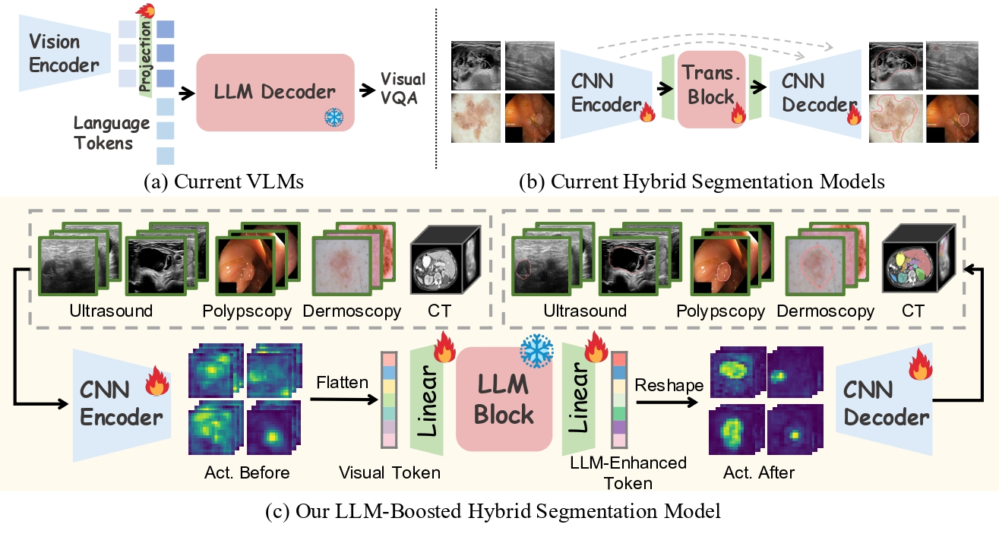
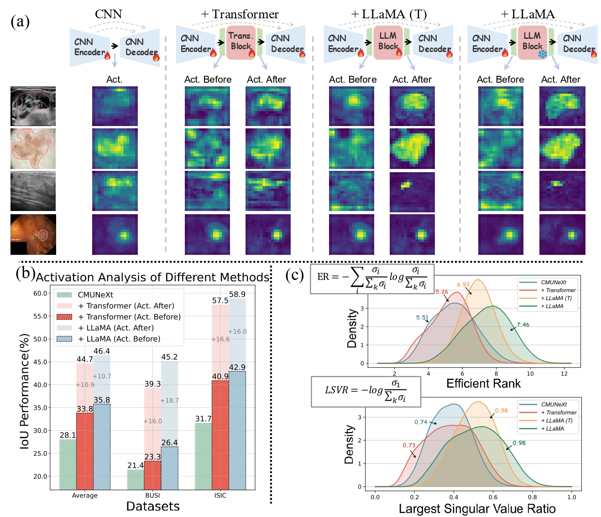
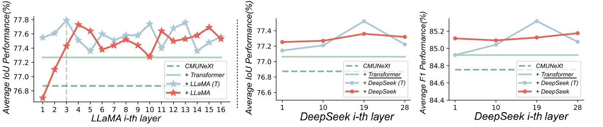

# Pre-Trained LLM is a Semantic-Aware and Generalizable Segmentation Booster




<div align="center">
    <span class="author-block">
    <a href="https://scholar.google.com/citations?user=x1pODsMAAAAJ&hl=en" target="_blank">Fenghe Tang</a><sup>1,2*</sup>,</span>
    <span class="author-block">
    <a href="https://scholar.google.com/citations?user=r0-tZ8cAAAAJ&hl=en" target="_blank">Wenxin Ma</a><sup>1,2*</sup>,</span>
    <span class="author-block">
    <a target="_blank">Zhiyang He</a><sup>3</sup>,</span>
    <span class="author-block">
    <a target="_blank">Xiaodong Tao</a><sup>3</sup>,</span>
    <span class="author-block">
    <a href="https://scholar.google.com/citations?user=Wo8tMSMAAAAJ&hl=en" target="_blank"> Zihang Jiang</a><sup>1,2</sup>,</span>
    <span class="author-block">
    <a href="https://scholar.google.com/citations?user=8eNm2GMAAAAJ&hl=en" target="_blank">S. Kevin Zhou</a><sup>1,2</sup>
    </span>
</div>

<br>

<div align="center">
    <sup>1</sup>
    <a target='_blank'>School of Biomedical Engineering, University of Science and Technology of China</a>&emsp;
    <br>
    <sup>2</sup> <a target='_blank'>Suzhou Institute for Advanced Research, University of Science and Technology of China</a>&emsp;
    <br>
    <sup>3</sup> <a target='_blank'>Anhui IFLYTEK CO., Ltd.</a>
    <br>
</div>


<br>
<br>

​                                                                              [](https://arxiv.org/pdf/2506.18034.pdf)   [](https://github.com/FengheTan9/LLM4Seg)    <a href="#LICENSE--citation"></a>


**News** 🥰:

- LLM4Seg is accepted by MICCAI 2025! 🎉


# Introduction

With the advancement of Large Language Model (LLM) for natural language processing, this paper presents an intriguing finding: a frozen pre-trained LLM layer can process visual tokens for medical image segmentation tasks. Specifically, we propose a simple hybrid  structure (LLM4Seg) that integrates a pre-trained, frozen LLM layer within the CNN encoder-decoder framework. Surprisingly, this design improves segmentation performance with a minimal increase in trainable parameters across various modalities, including ultrasound, dermoscopy, polypscopy, and CT scans. Our in-depth analysis reveals the potential of transferring LLM's semantic awareness to enhance segmentation tasks, offering both improved global understanding and better local modeling capabilities. The improvement proves robust across different LLMs, validated using LLaMA and DeepSeek.



# Get Start

#### Environment

- Pytorch: 2.5-Cuda 12.4
- Python: 3.9
- transformer: 4.46.3 (LLM environment)
- albumentations: 1.2.0（medical image augmentation）

#### LLM prepare

- Apply LLama 3.2-1B or DeepSeek-R1 on HuggingFace 🤗🤗🤗
- huggingface-cli login

#### Datasets

Please put the dataset (e.g. [BUSI](https://www.kaggle.com/aryashah2k/breast-ultrasound-images-dataset)) or your own dataset as the following architecture. 
```
└── LLM4Seg
    ├── data
        ├── busi
            ├── images
            |   ├── benign (10).png
            │   ├── malignant (17).png
            │   ├── ...
            |
            └── masks
                ├── 0
                |   ├── benign (10).png
                |   ├── malignant (17).png
                |   ├── ...
        ├── your dataset
            ├── images
            |   ├── 0a7e06.png
            │   ├── ...
            |
            └── masks
                ├── 0
                |   ├── 0a7e06.png
                |   ├── ...
    ├── dataloader
    ├── network
    ├── utils
    ├── main.py
    └── split.py
```


#### Simple integration into your network




```python
from network.llm4seg import LLM4Seg


#   unfreeze (bool): Whether to unfreeze the LLM layer for fine-tuning.
#   need_init (bool): Whether to initialize the LLM layer.
#   mode (str): LLM layer: "LLaMA" or "DeepSeeK".
#   channel (int): Number of input feature channels, typically from the encoder output (e.g., dims[4]).
#   layer (int): i-th LLM layers to use.
#   h (int): Height of the input feature map.
#   w (int): Width of the input feature map.
llm4seg = LLM4Seg(unfreeze=False, need_init=False, mode="llama", channel=dims[4], layer=14, h=16, w=16)

# forward
fs_boosted = llm4seg(fs)
```


#### Training and Validation

You can first split your dataset:

```python
python split.py --dataset_name busi --dataset_root ./data
```

Train and validate your dataset:

```python
# + DeepSeeK 28-th layer:
python main.py --mode deepseek --layer 27 --base_dir ./data/busi --train_file_dir busi_train.txt --val_file_dir busi_val.txt
# + DeepSeeK (T) 18-th layer:
python main.py --mode deepseek --layer 17 --unfreeze --base_dir./data/busi --train_file_dir busi_train.txt --val_file_dir busi_val.txt
# + DS Transformer 18-th layer:
python main.py --mode deepseek --layer 17 --need_init --base_dir./data/busi --train_file_dir busi_train.txt --val_file_dir busi_val.txt


# + LLaMA 18-th layer:
python main.py --mode llama --layer 17 --base_dir ./data/busi --train_file_dir busi_train.txt --val_file_dir busi_val.txt
# + LLaMA (T) 8-th layer:
python main.py --mode deepseek --layer 7 --unfreeze --base_dir./data/busi --train_file_dir busi_train.txt --val_file_dir busi_val.txt
```


#### Acknowledgements:

This code uses helper functions from [CMUNeXt](https://github.com/FengheTan9/CMUNeXt).


#### Citation

If the code, paper and weights help your research, please cite:

```
@article{llm4seg,
  title={Pre-Trained LLM is a Semantic-Aware and Generalizable Segmentation Booster},
  author={Tang, Fenghe and Ma, Wenxin and He, Zhiyang and Tao, Xiaodong and Jiang, Zihang and Zhou, S Kevin},
  journal={arXiv preprint arXiv:2506.18034},
  year={2025}
}
```


#### License

This project is released under the Apache 2.0 license. Please see the [LICENSE](LICENSE) file for more information.

